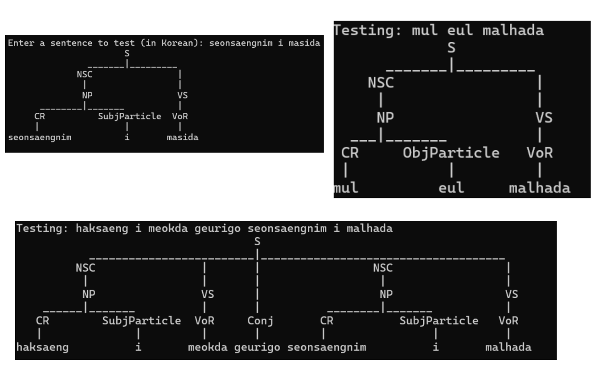

# Evidence2-Grammars

# Korean Language Structure

## Overview
The most prominent links Korean to the Altaic languages of central Asia, a family that includes Turkish, Mongolian, and Siberia's Tungusic (for example, Manchu) languages. Others would argue for including Uralic languages (Hungarian and Finnish) and Japanese in this macro family. Although not definitively proven, this affiliation is accepted by most Korean linguists and deemed likely by Western linguists as well. The competing theory associates Korean with the Dravidian languages of southern India or with Austronesian languages. Determining Koreans' linguistic affiliation is complicated by a long history of contact with the Japanese and Chinese languages. Not surprisingly, Korean shares certain linguistic features with each of these languages.

## Korean Language Structure
Korean is an agglutinative language, meaning that it forms words and expresses grammatical relations by attaching particles or suffixes to a word. Some features include:

- **Honorifics**: Korean has a system of honorifics that affects verb endings and vocabulary. The level of politeness and respect indicated by these forms is essential in conversations.
- **No articles**: Korean does not use definite or indefinite articles. Understanding plurality or gender often depends on context.
- **Noun particles**: Particles are used to mark case roles like subject, object, or location.
- **Verb-final**: Korean follows a subject-object-verb (SOV) word order. Verbs come at the end of the sentence.

## Nouns
Korean nouns change based on grammatical case and number.

### Plural Formation
- General plural: Add **들 (deul)**.
  - 책 (chaek) = book → 책들 (chaekdeul) = books
  - 사람 (saram) = person → 사람들 (saramdeul) = people

### Honorific Nouns
- Example:
  - 어머니 (eomeoni) = mother → 어머님 (eomeonim) = respectful form

## Verb Conjugation

### Politeness Levels
- **Formal polite**: -습니다 / -ㅂ니다  
  - 먹다 → 먹습니다
- **Informal polite**: -요  
  - 먹다 → 먹어요

### Tenses
- **Past**: -았/었/였  
  - 먹다 → 먹었어요

## Pronouns
- I: 나 (informal), 저 (formal)
- You: 너 (informal), 당신 (formal)

## Example Sentences
- 사람들은 책을 읽어요. = The people read books.
- 어머니는 집에 계세요. = My mother is at home (respectful)

## Model

### Nouns
- haksaeng – student
- seonsaengnim – teacher
- chingu – friend
- mul – water
- jib – house
- haksang – school
- kpop – K-pop
- aideol – idol
- eumak – music
- norae – song
- albom – album

### Verbs
- gada – to go
- meokda – to eat
- masida – to drink
- boda – to see/watch
- malhada – to speak
- saranghada – to love
- isseoyo – to exist / have (polite)

### Conjunctions
- geurigo – and
- ttoneun – or
- hajiman – but
- waenyaheumyeon – because

## Grammar
Korean has specific sentence structures, particularly with subject-object-verb (SOV) order and the use of particles to mark subjects, objects, and other sentence components. Additionally, Korean has various particles for case markers, topics, and conjunctions, which need to be incorporated into the grammar. For this case, we are going to use the most basic sentence structure, not conditional sentences, questions, etc, straightforward 

### 1.Initial Structure
In Korean, sentences (S) often consist of noun phrases (NP) followed by verb phrases (VS). However, the subject, object, and verb are marked with particles. The way to start the structure will be:
- S → NP NP VS  
- S → NP VS  
- S → VS

### 2. Noun Phrases and Verb Phrases
The way to give the noun phrases and verb phrases a breakdown is to take into consideration the sentence structure established beforehand:
- NP → CR + SubjParticle  
- NP → CR + ObjParticle
- NP → CR
- NP → CR + NP

- VS → VoR + TenseMarker + PolitenessEnding
- VS → VoR + PolitenessEnding
- VS → VoR + TenseMarker
- VS → VoR

### 3. Verb and Noun Subcategories
As it was established before, there are roots for the verb (VoR), tenses, and politeness, which in our case are going to be:
- VoR → gada | meokda | masida | boda | malhada | saranghada
- TenseMarker → at | eot  
- PolitenessEnding → eoyo  | seumnida 

For nouns, we will be using common ones (CR) and their particles:
- CR → 'haksaeng' | 'seonsaengnim' | 'chingu' | 'mul' | 'jib' | 'haksang' | 'kpop' | 'aideol' | 'eumak' | 'norae' | 'albom'
- SubjParticle -> 'eun' | 'neun' | 'i' | 'ga'
- ObjParticle -> 'eul' | 'reul'
  
### 4. Conjunctions
The conjunctions, which help add more information to the sentences:
- Conj → 'geurigo' | 'ttoneun' | 'hajiman' | 'waenyaheumyeon'

### 5. Ambiguity and Left Recursion
Korean allows multiple noun phrases to be connected with conjunctions. To eliminate the ambiguity in some cases, a new structure needs to be defined:
- NSC -> NP | NP Conj NP
  
- **NSC** represents a noun phrase connected by conjunctions.
- **Conj** represents conjunctions.
- **NP** represents a single noun phrase, as it was written before.

Changing the structure of the sentence to:
- S -> NSC VS | NSC VS NSC | S Conj S | NSC VS Conj VS | NSC VS Conj NSC VS | NSC NSC VS

### 6. Final Grammar
```
S -> NSC VS | NSC VS NSC | S Conj S | NSC VS Conj VS | NSC VS Conj NSC VS |NSC NSC VS
NSC -> NP | NP Conj NP
NP -> CR SubjParticle | CR ObjParticle | CR | CR NP
VS -> VoR TenseMarker PolitenessEnding | VoR PolitenessEnding | VoR | VoR TenseEnding
VoR -> 'gada' | 'meokda' | 'masida' | 'boda' | 'malhada' | 'saranghada'
TenseMarker -> 'at' | 'eot'
PolitenessEnding -> 'eoyo' | 'seumnida'
SubjParticle -> 'eun' | 'neun' | 'i' | 'ga'
ObjParticle -> 'eul' | 'reul'
CR -> 'haksaeng' | 'seonsaengnim' | 'chingu' | 'mul' | 'jib' | 'haksang' | 'kpop' | 'aideol' | 'eumak' | 'norae' | 'albom'
Conj -> 'geurigo' | 'ttoneun' | 'hajiman' | 'waenyaheumyeon'
```

**Explanation:**

- `S` → Sentence structure allows different valid Korean sentence forms.  
- `NSC` → Noun phrase chain with conjunction.  
- `NP` → A single noun with its particle.  
- `VP` → Verb phrase with stem, tense, and politeness ending.  
- `VoR` → Verb roots.  
- `TenseMarker` → Shows verb tense.  
- `PolitenessEnding` → Shows the level of politeness in the sentence.  
- `CR` → Common Korean nouns used in phrases.  
- `SubjParticle` → Particles marking the subject.  
- `ObjParticle` → Particles marking the object.  
- `Conj` → Conjunctions used to connect phrases.

## Implementation
To test the grammar, a program in Python needs to be written. Adding the grammar established before, some correct sentences, and some incorrect ones. The program prints the trees for the correct ones, but a string that says the sentences are invalid if the sentences don’t follow the structure.

### Correct sentences

- haksaeng eul meokda — Eat the student
- chingu eul meokda geurigo saranghada — Eat the friend and love
- seonsaengnim i masida — The teacher drinks
- haksaeng eun norae reul masida — The student drinks the song
- jib eul meokda eoyo — Eat the house (formal)
- haksaeng i saranghada eoyo — The student loves (formal)
- mul eul malhada — Speak the water
- haksaeng eul meokda hajiman chingu eul malhada — Eat the student but speak with the friend
- seonsaengnim eun haksaeng eul saranghada — The teacher loves the student
- haksaeng i meokda geurigo seonsaengnim i malhada — The student eats and the teacher speaks
- haksaeng eul malhada — Speak to the student
- haksaeng i saranghada — The student loves
- seonsaengnim eul masida — Drink the teacher

### Incorrect sentences

- jib masida wa chingu eul meokda — Drink the house and eat the friend
- seonsaengnim i meokda wa haksaeng eul saranghada — The teacher eats and loves the student
- chingu eul masida wa jib eul meokda — Drink the friend and eat the house
- albom eul meokda eoyoseo norae masida — Eat the album and thus drink the song
- kpop eul meokda wa eumak eul masida — Eat kpop and drink music
- haksaeng eun haksang eul meokda wa seonsaengnim eul masida — The student eats the student and drinks the teacher

### Running code

To run the code, use the program `koreangrammar.py`. First, you run the pre-established tests to see if the program shows valid results. The second part is the person running the file trying to write a sentence following the rules. The sentence doesn’t have to have any kind of sense, the important thing is that the structure is correct.  
To create the Python program for testing the Korean grammar and generating syntax trees for valid sentences, it is needed the library **NLTK (Natural Language Toolkit)**.

### Examples of the correct trees
These are for the valid sentences as trees:



## Analysis
The structure of the Korean grammar involves parsing and checking various parts of the sentence, such as noun phrases (NP), verb phrases (VS), and their corresponding particles. 

- **Word Segmentation**: The grammar requires the separation of the root word and the endings (like verb stems or noun particles). This process requires checking each word, and with a loop iterating over each word of a sentence, this results in **O(n)** complexity.
- **Parsing with Loops**: For each sentence, we iterate over its parts (Noun Phrases, Verb Phrases), which is an **O(n)** operation. Since the structure of the grammar is LL(1), we only generate one possible parse tree, which results in **O(1)** complexity.
- **Total Complexity**: The overall time complexity remains **O(n)**.

Korean grammar can be classified as a Context-Free Grammar (CFG).  
**Context-Free Grammar:** Each production rule has a single non-terminal on the left side, and a combination of non-terminals and terminals on the right side (e.g., S -> NSC VS | NSC VS NSC). This structure satisfies the definition of context-free grammar, where the left side has a single non-terminal, and the right side can have both terminals and non-terminals.

While the current implementation uses Python's NLTK for parsing the Korean grammar, other tools or languages could be explored for implementing similar functionality. For example, a JavaScript library called Peggy (previously known as Peg.js) could be a viable alternative.

**Peggy for Node.js:**

- **Pros**: Peggy allows you to define grammar in a separate file and then compile it into a parser. It is highly documented and provides tools for building parsers directly from the grammar.
- **Cons**: The process of compiling the grammar takes extra time, and the learning curve for setting it up is steeper compared to NLTK in Python.

**NLTK for Python:**

- **Pros**: NLTK provides a straightforward way to implement and test grammars. It doesn't require a separate compilation process, and everything can be kept in a single Python file, which is simpler and faster for development.
- **Cons**: NLTK is mainly suited for tasks within Python and doesn’t have the built-in tools for creating web applications like JavaScript/Node.js can provide.

### References

GeeksForGeeks. (2022). *Regular grammar (Model regular grammar)*. GeeksForGeeks. https://www.geeksforgeeks.org/regular-grammar-model-regular-grammars/

GeeksForGeeks. (2023). *Introduction to syntax analysis in compiler design*. GeeksForGeeks. https://www.geeksforgeeks.org/introduction-to-syntax-analysis-in-compiler-design/

Peggy. (n.d.). *Parser generator for JavaScript*. Peggy. https://peggyjs.org/development/index.html

Lark Parser. (2024). *Lark - Parsing toolkit for Python*. Lark Parser. https://lark-parser.readthedocs.io

Asia Society. (n.d.). *Korean language*. Asia Society. https://asiasociety.org/education/korean-language

90 Day Korean. (n.d.). *Korean pronouns*. 90 Day Korean. https://www.90daykorean.com/korean-pronouns/
